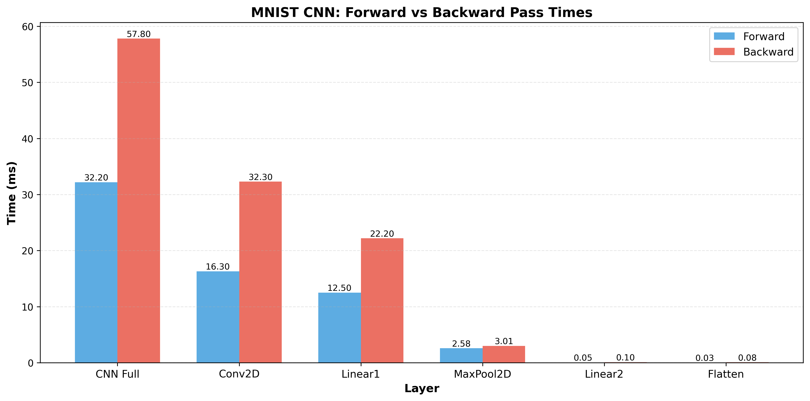

# Benchmark v1.0.0

**Date:** 2026-07-19 | **System:** macOS M3 (2023)

## Observation

Training the MNIST CNN is exceptionally slow. A single epoch takes significantly longer than expected, even compared to the MLP baseline.

## Hypothesis

The nested-loop Conv2D implementation is suspected to be the primary bottleneck. The current approach iterates over:
1. Batch dimension
2. Output channels
3. Spatial dimensions (height, width)
4. Input channels
5. Kernel dimensions (height, width)

**Code structure (pruned):**

```cpp
for (size_t b = 0; b < batch_size; ++b) {                               // batch
    for (size_t oc = 0; oc < out_channels; ++oc) {                      // output channels
        for (size_t h = 0; h < out_h; ++h) {                            // spatial
            for (size_t w = 0; w < out_w; ++w) {
                for (size_t ic = 0; ic < in_channels; ++ic) {           // input channels
                    for (size_t kh = 0; kh < kernel_size; ++kh) {       // kernel
                        for (size_t kw = 0; kw < kernel_size; ++kw) {
                            // ...
                        }
                    }
                }
            }
        }
    }
}
```

This is O(batch × out_channels × out_h × out_w × in_channels × kernel × kernel), of which batch, out_channels, in_channels, and kernel can be seen as constants.

## Benchmarks

To test the hypothesis of the convolutional layers being the bottleneck, banchmarks for all included layers have been implemented in the file `benchmarks/bench_cnn.cpp`.

The results can be seen below.

```text
--------------------------------------------------------------------
Benchmark                          Time             CPU   Iterations
--------------------------------------------------------------------
BM_Conv2D_Forward               16.3 ms         16.3 ms           43
BM_Conv2D_BackwardPass          32.3 ms         32.2 ms           22

BM_MaxPool2D_Forward            2.58 ms         2.58 ms          273
BM_MaxPool2D_BackwardPass       3.01 ms         3.01 ms          231

BM_Flatten_Forward             0.027 ms        0.027 ms        26372
BM_Flatten_BackwardPass        0.080 ms        0.080 ms         8758

BM_Linear1_Forward              12.5 ms         12.5 ms           56
BM_Linear1_BackwardPass         22.2 ms         22.2 ms           31

BM_Linear2_Forward             0.048 ms        0.048 ms        14685
BM_Linear2_BackwardPass        0.096 ms        0.096 ms         7372

BM_CNN_FullForwardPass          32.2 ms         32.2 ms           22
BM_CNN_FullBackwardPass         57.8 ms         57.7 ms           11
```

The times can be seen visually below.



## Interpretation

Looking at the retrieved measurements we see, that the layers Conv2D and Linear1 contribute by far the most to the overall execution time.

**Linear1:**

This layer connects all flattened features to the next linear layer, which leads to the number of parameters of `n_linear1 = (16 * 13 * 13) * 128 = 346'112`. Considering that the entire network has `n_total = 347'690` parameters, this accounts for `99.55%` of the entire network. This circumstance leading to a significant part of the execution time is not surprising.

**Conv2D:**

A very interesting finding is, that the convolutional layer takes even longer than the first linear layer, making up for the largest part of the overall runtime.

*This supports our hypothesis by indicating, that the largest computational complexity is somewhere in the convolution logic.*
