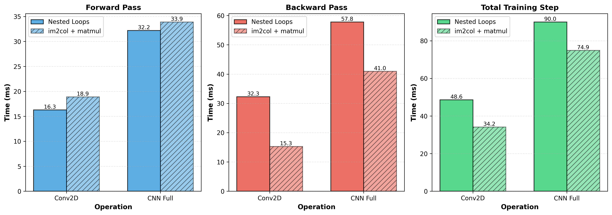

# Benchmark v1.1.0

Based on the results from v1.0.0, the implementation of the Conv2D layer was adapted to use `im2col` instead of the plain nested for-loop. This is expected to speed up the process due to the sequential data access pattern in the im2col matrix.

## Observation

The convolutional layer is computationally the most expensive one, as we saw in `bm-v.1.0.0.md` before. A possible reason for this could be the nested for-loop in the function `conv2d_autodiff`

```cpp
// Convolution computation
for (size_t b = 0; b < batch; ++b) {
    for (size_t oc = 0; oc < out_channels; ++oc) {
        for (size_t h_out = 0; h_out < out_height; ++h_out) {
            for (size_t w_out = 0; w_out < out_width; ++w_out) {
                // ...

                for (size_t ic = 0; ic < in_channels; ++ic) {
                    for (size_t kh = 0; kh < kernel_size; ++kh) {
                        for (size_t kw = 0; kw < kernel_size; ++kw) {
                            // ...
                        }
                    }
                }

                // ...
            }
        }
    }
}
```

as the implementation leads to complex, non-contiguous data access patterns.

## Hypothesis

Refactoring this loop to use the `im2col` approach, enabling sequential and therefore more cache-friendly data access, should speed up the computation of the convolutional layer.

**Important Note:**

Currently, our matrix operations use the self-defined and sequential `Tensor::matmul()` method, not utilizing parallelization. This holds potential for further performance optimization, but is not realized in this version `v1.1.0`.

## Benchmarks

The new `im2col` structure was implemented and the already implemented benchmark `bench_cnn.cpp` was repeated, which led to the followign results.

```text
--------------------------------------------------------------------
Benchmark                          Time             CPU   Iterations
--------------------------------------------------------------------
BM_Conv2D_Forward               18.4 ms         18.4 ms           38
BM_Conv2D_BackwardPass          15.1 ms         15.1 ms           47

BM_MaxPool2D_Forward            2.57 ms         2.57 ms          270
BM_MaxPool2D_BackwardPass       3.05 ms         3.05 ms          228

BM_Flatten_Forward             0.027 ms        0.027 ms        26431
BM_Flatten_BackwardPass        0.080 ms        0.080 ms         8832

BM_Linear1_Forward              12.8 ms         12.8 ms           54
BM_Linear1_BackwardPass         22.6 ms         22.6 ms           31

BM_Linear2_Forward             0.050 ms        0.050 ms        14099
BM_Linear2_BackwardPass        0.098 ms        0.098 ms         7175

BM_CNN_FullForwardPass          34.4 ms         34.4 ms           21
BM_CNN_FullBackwardPass         42.0 ms         42.0 ms           17
```

A comparison has been plotted visually.



## Interpretation

As expected we see, that the total training time decreases from *90ms* to *74.9ms* (*-16.8%*) for the full CNN model and from *48.6ms* to *34.2ms* (*29.6%*) for the Conv2D layer itself.

Also, the execution time for the backward pass is significantly reduced from *57.8ms* to *41.0ms* (*-29.1%*) for the full CNN model and from *32.3ms* to *15.3ms* (*-52.6%*) for the Conv2D layer.

**The Unexpected...**

Surprisingly we find, that the executing time for the forward pass even increased slightly, as it can be seen in the plot above!

A likely explanation is that the current implementation performs additional memory copies for every batch sample before and after the matrix multiplication. Consequently, the reduced computation time is partially offset by the increased memory overhead. Furthermore, the convolution is currently executed as one smaller matrix multiplication per batch instead of a single large one, preventing the implementation from fully exploiting the advantages of the `im2col` formulation.

**Possible Solution:**

To solve this performance issue during the forward pass, the following issues could be addressed.

- GEMMs are split up batch-wise -> Fix the reshape-issues to keep batches combined!
- Copies of the Tensors are made -> Work with views!
- Missing parallelization of the GEMMs -> Research how to parallelize matmul best!
